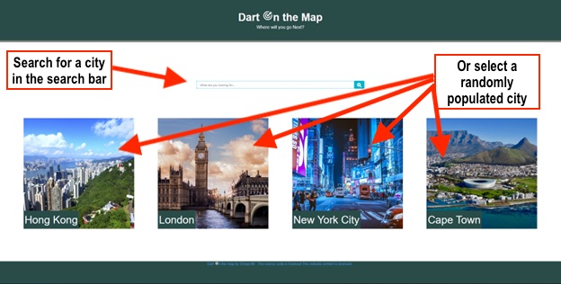
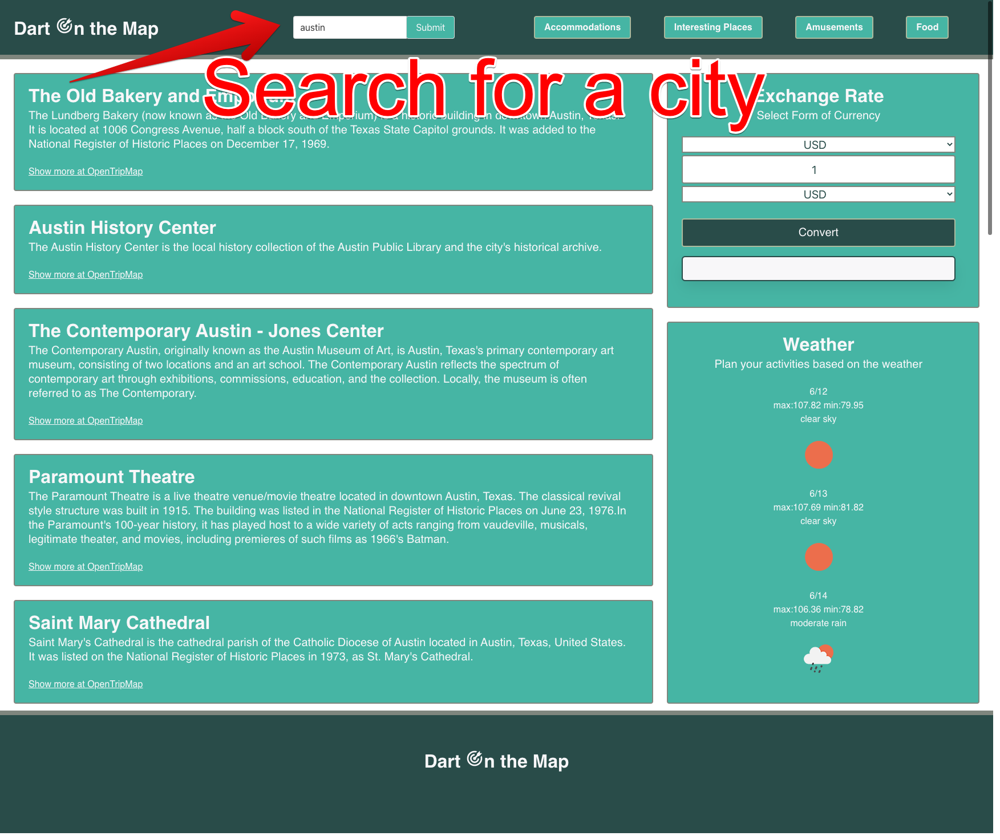
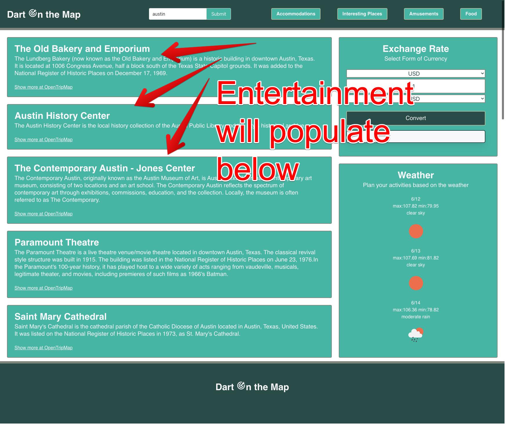
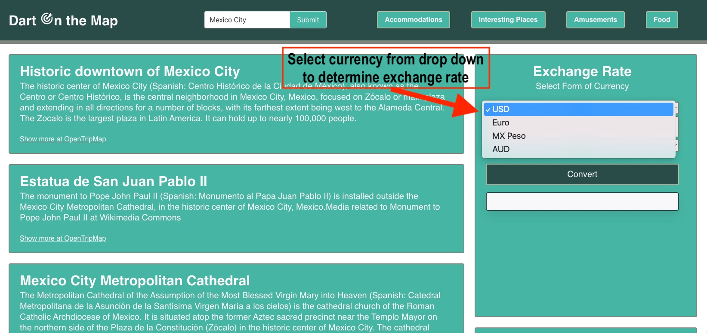
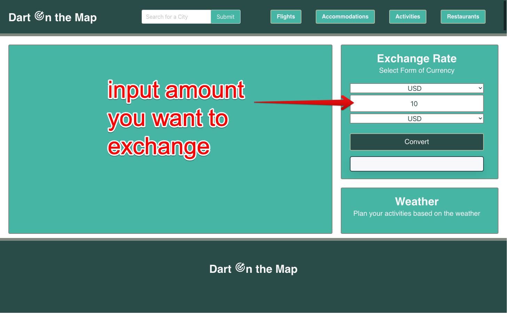
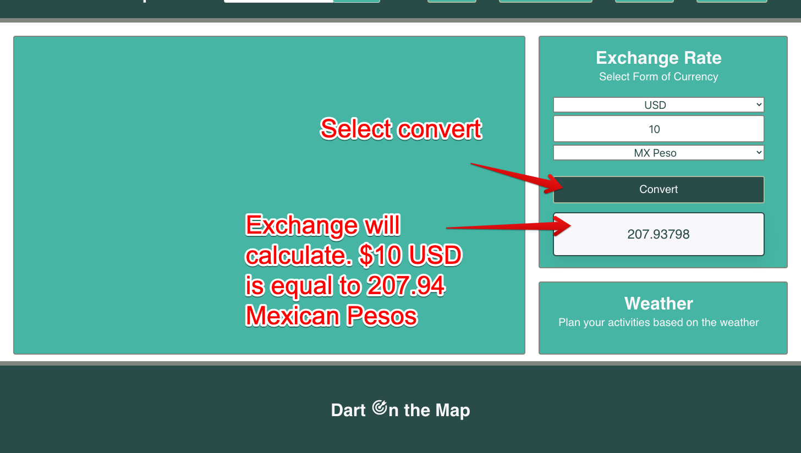
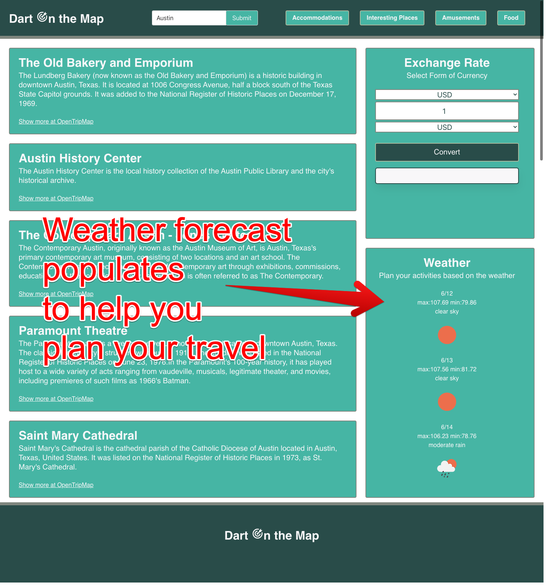
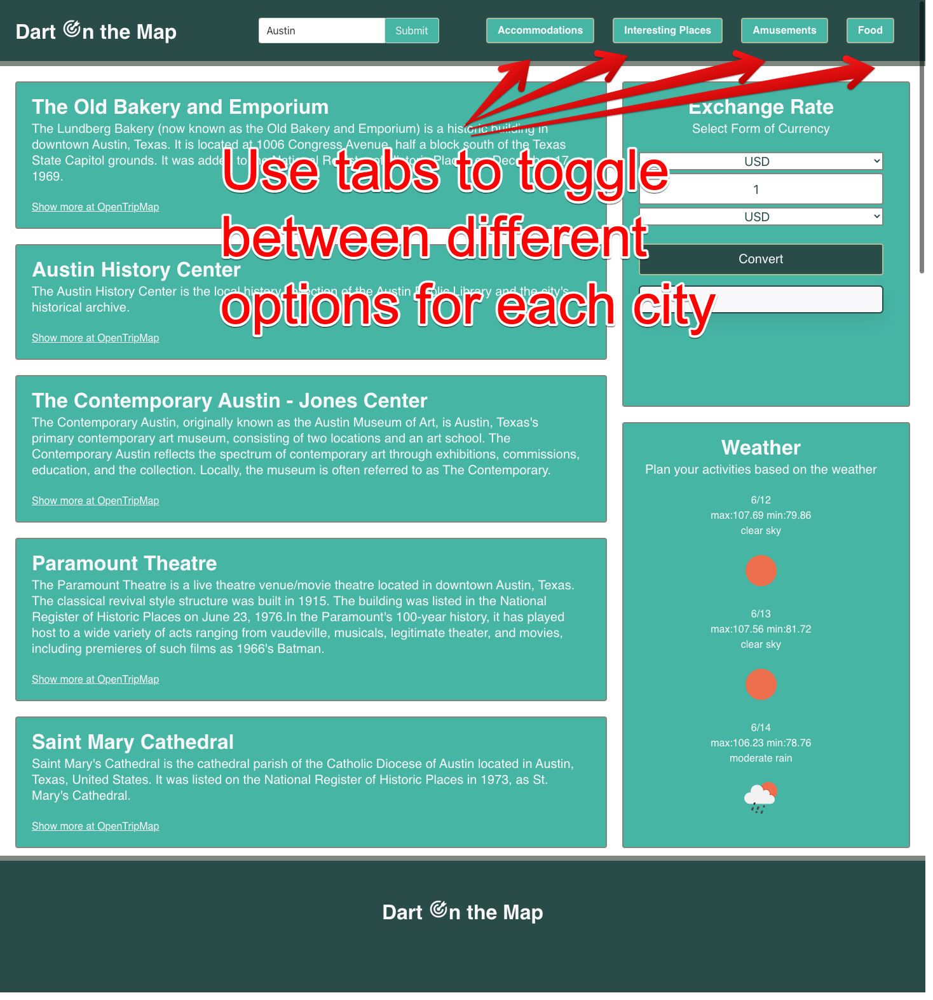

# Dart on the Map
Welcome to Dart on the Map! 

This application is inspired by the desire to throw a dart on a map and travel to the place it strikes. We support spontaneity and hope to bring this idea to fruition through our site. Plan your upcoming travel, whether destination known or unknown, with Dart on the Map. Let your spontaneous side shine and let the dart decide. 

It may seem scary, but we are firm believers that, 'taking the road less traveled can make all the difference.' At Dart on the Map, take the scary out of spontaneous travel and recieve help planning your trip. 

Where will you go next?

 

# Wireframe
As a team, a first draft of the search page was developed:

The search page wireframe was developed further to include brand colors and a clearer vision for all developers to utilize: 

A first draft of the resutls page was developed: 

The results page wireframe was developed further to include brand colors, id's and a clearer vision for all developers to utilize:

First draft of mobile view: 

The mobile page wireframe was developed further to include brand colors and a clearer vision for all developers to utilize:

 

# Overview
A brief overview to demonstrate how to use Dart on the Map.
 

 

 

 

 

 

 

 

 

 

# Deployed Website Link
[Dart on the Map](https://jadentr44.github.io/Dart-On-The-Map/) 

 

# Collaborators 
* [Angel Meza](https://github.com/amezabla)
* [Jaden Rodriguez](https://github.com/Jadentr44)
* [Zach Serrano](https://github.com/ZSerrano)
* [Chelsea Sexton](https://github.com/chelsea314)

 

# Resources
* [Bulma](https://bulma.io/documentation/)
* [jQuery](https://api.jquery.com/)
* [Iconify](https://iconify.design/)
* [Font Awesome](https://fontawesome.com/icons)
* [Open Weather API](https://openweathermap.org/api)
* [Open Trip Map API](https://opentripmap.io/product)
* [Exchange Rates Data API](https://apilayer.com/marketplace/exchangerates_data-api)

 

# License
MIT License

Copyright (c) 2022 Chelsea Sexton

Permission is hereby granted, free of charge, to any person obtaining a copy
of this software and associated documentation files (the "Software"), to deal
in the Software without restriction, including without limitation the rights
to use, copy, modify, merge, publish, distribute, sublicense, and/or sell
copies of the Software, and to permit persons to whom the Software is
furnished to do so, subject to the following conditions:

The above copyright notice and this permission notice shall be included in all
copies or substantial portions of the Software.

THE SOFTWARE IS PROVIDED "AS IS", WITHOUT WARRANTY OF ANY KIND, EXPRESS OR
IMPLIED, INCLUDING BUT NOT LIMITED TO THE WARRANTIES OF MERCHANTABILITY,
FITNESS FOR A PARTICULAR PURPOSE AND NONINFRINGEMENT. IN NO EVENT SHALL THE
AUTHORS OR COPYRIGHT HOLDERS BE LIABLE FOR ANY CLAIM, DAMAGES OR OTHER
LIABILITY, WHETHER IN AN ACTION OF CONTRACT, TORT OR OTHERWISE, ARISING FROM,
OUT OF OR IN CONNECTION WITH THE SOFTWARE OR THE USE OR OTHER DEALINGS IN THE
SOFTWARE.
